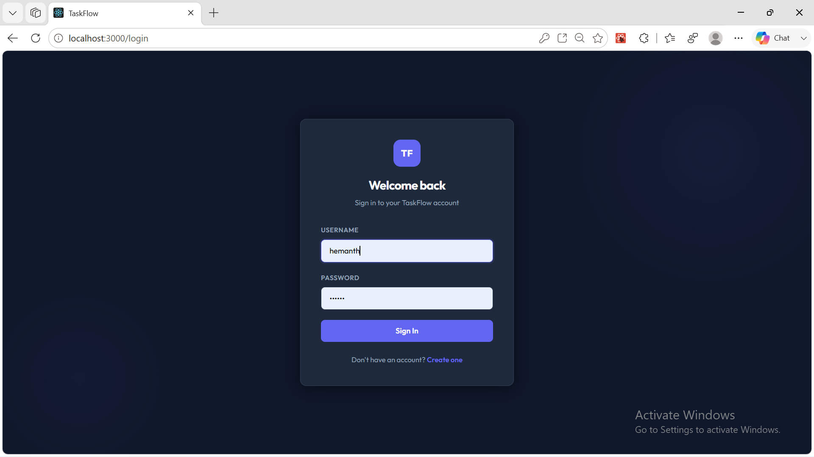
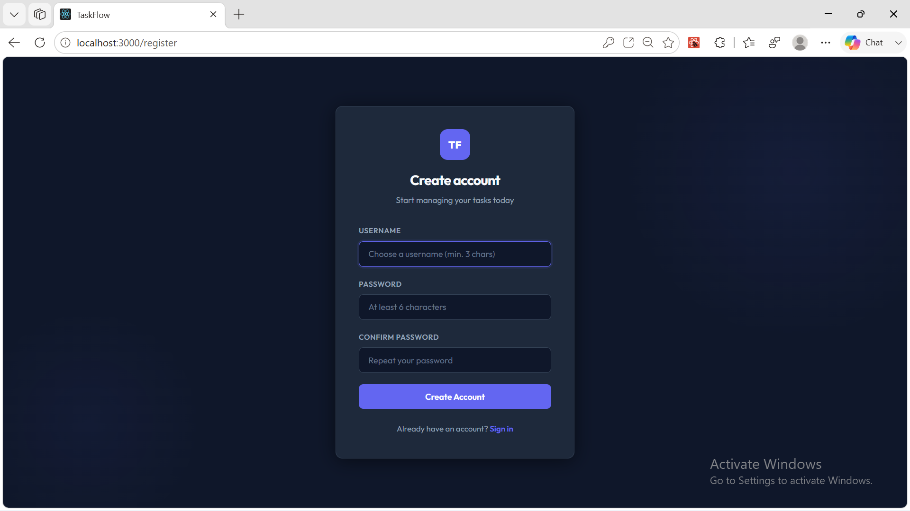
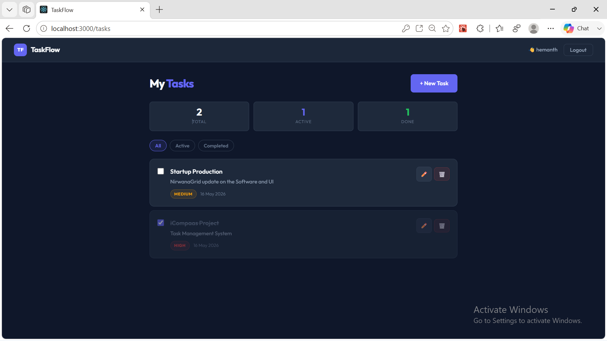
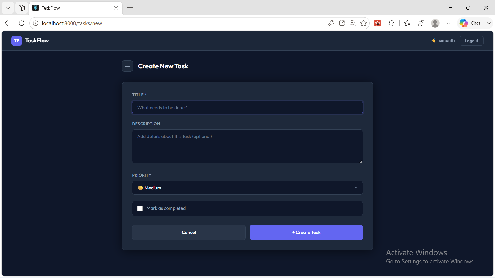
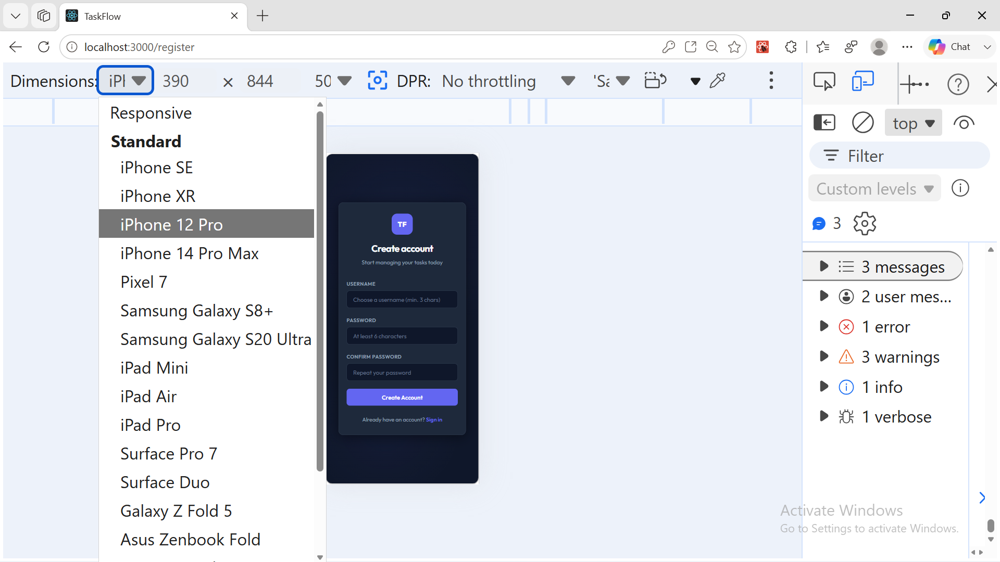

# TaskFlow - Task Management System

A full-stack task management application built using React.js and Flask with JWT authentication.

## Features

- User Registration and Login
- JWT Authentication
- Create, Edit, Delete Tasks
- Mark Tasks as Completed
- Task Priority Support
- Protected Routes
- Responsive UI

## Tech Stack

### Frontend
- React.js
- Axios
- React Router

### Backend
- Flask
- Flask-JWT-Extended
- SQLite

## Project Structure

task-management-system/
│
├── backend/
├── frontend/
└── README.md

## Run Locally

### Backend

cd backend
pip install -r requirements.txt
python app.py

### Frontend

cd frontend
npm install
npm start

## API Routes

POST /register  
POST /login  
GET /tasks  
POST /tasks  
PUT /tasks/:id  
DELETE /tasks/:id

## Future Improvements

- Email Notifications
- Pagination
- User Profile Management
- Task Deadlines

## Screenshots

### Login Page

### Create Account

### Dashboard

### Task Creation

### Mobile Responsive View
